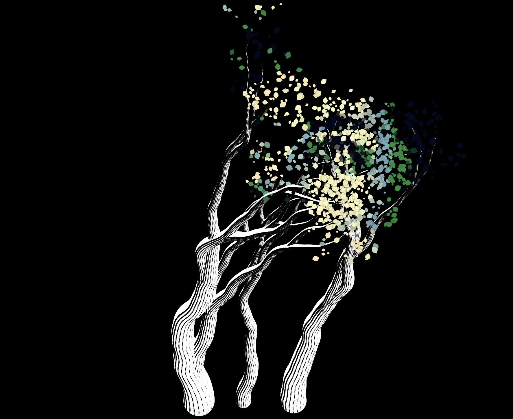
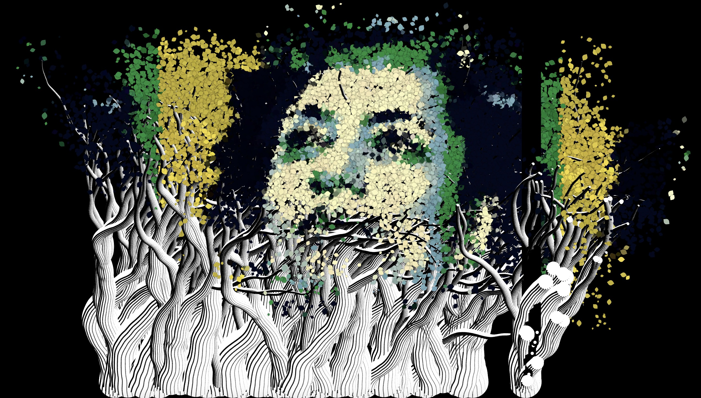
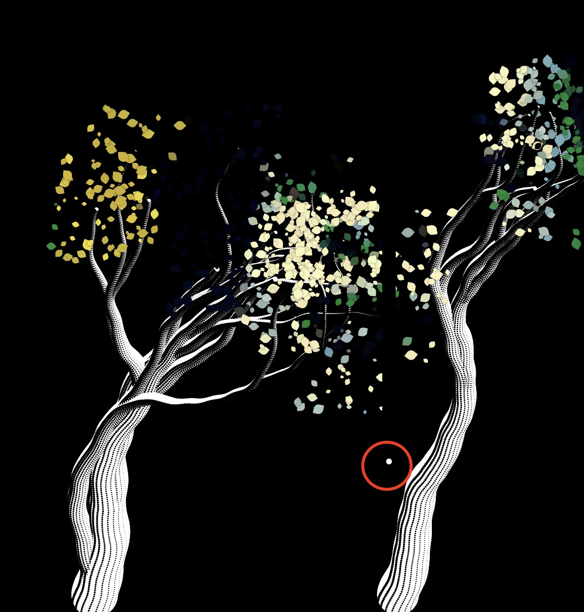
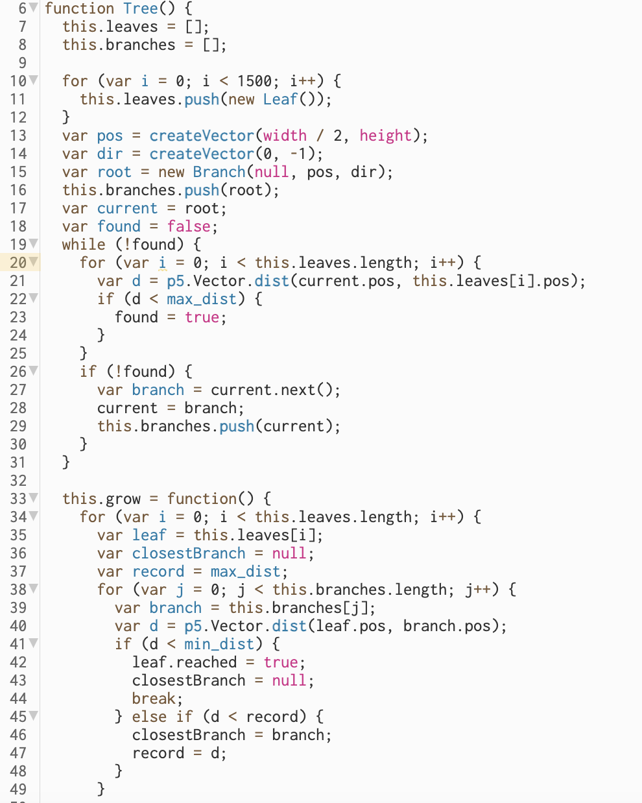
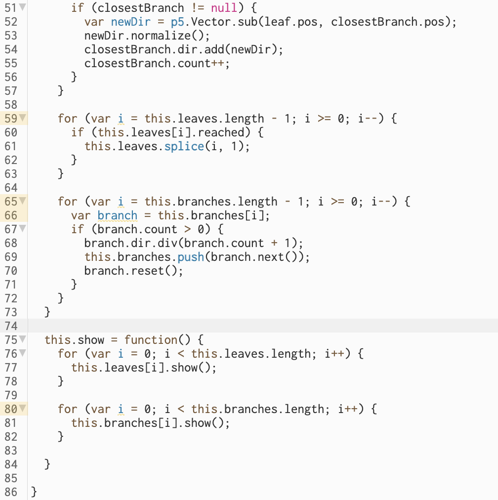
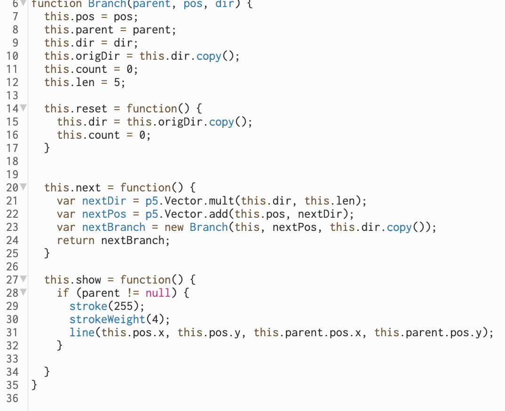
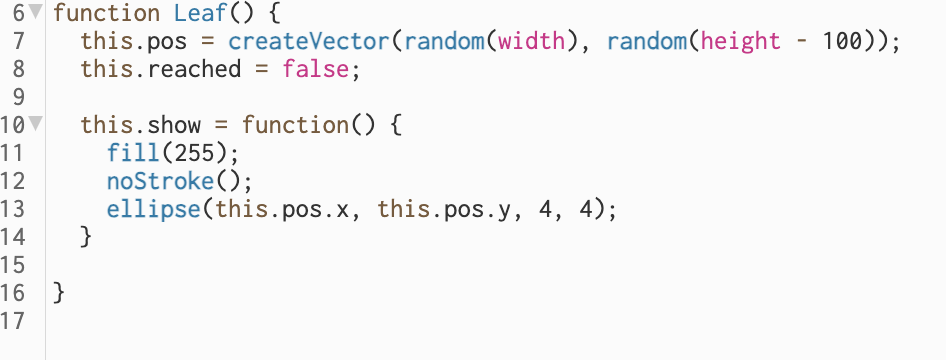

# xwan0876_quiz_8

## Part1: Imaging Technique Inspiration

### 1.1 Introduction of the Design 
 According to the following picture, the design work generates a series of randomly growing trees and leaves on the canvas by clicking the mouse. 

This is the initial state that the trees are generated once you click the mouse.

And this is the final display that the portrait will be seen when there are enough leaves.

### 1.2 Insights
- **Interactive effect**    
  **Set the theme of the scene**, and the effect of sowing seeds through mouse events at the beginning, making the design more story-telling. Randomness and dynamic changes are then used to simulate the growth process of trees, which can attract the user's attention and increase the charm of the artwork.

- **Elemental Connection**
  Portrait Marielle spent her life fighting for women's rights and died of assassination. Although Marielle passed away, the tree symbolized new life. Fill the face of the portrait with leaves to achieve a texture effect of leaves, creating a more vivid and textured effect.
  

## Part2: Coding Technique Exploration

### 2.1 Code Example and Analysis
link:https://editor.p5js.org/codingtrain/sketches/r9pxis9g-
- **How to create trees**  
     
  The root branch of the tree is created, and a loop is used to generate other branch objects of the tree until a branch object is close to the leaf object, indicating the end of the tree's growth.

  
  

- **How to create branches**  
  
  Set properties include position(pos), parent branch (parent), direction(dir), initial direction(origDir), counter(count), and length(len).
  
  Methods include resetting the direction(reset), calculating the next branch(next), and displaying graphics(show).

  

- **How to create leaves**  
  Use “createVector()” to generate a random position that prevents the leaves appearing at the bottom of the canvas. And create an attribute "reached" in the leaf object to indicate whether the leaf has reached the target position.

  
                                  